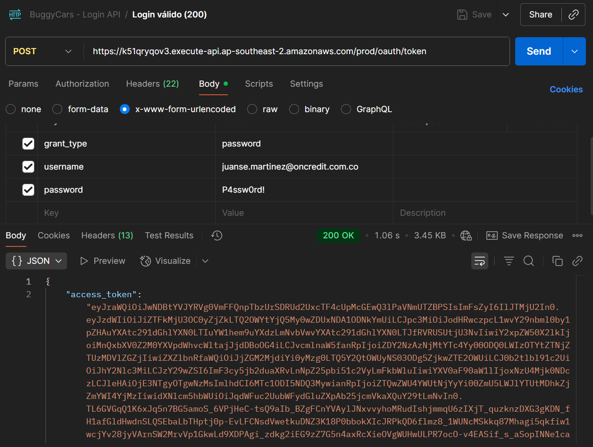
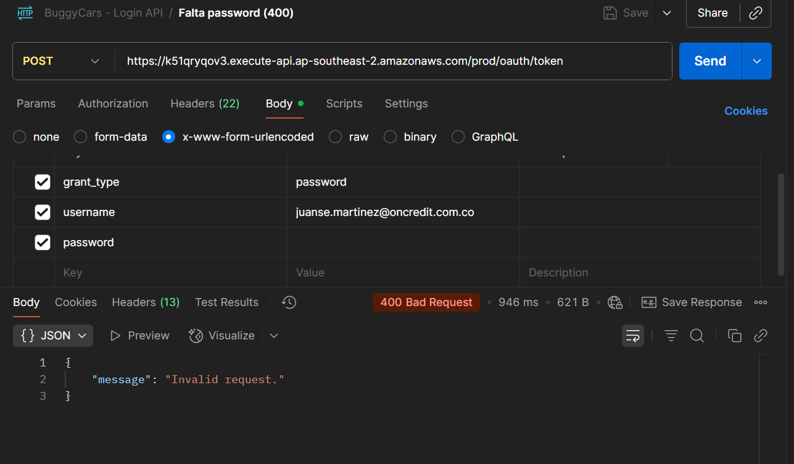
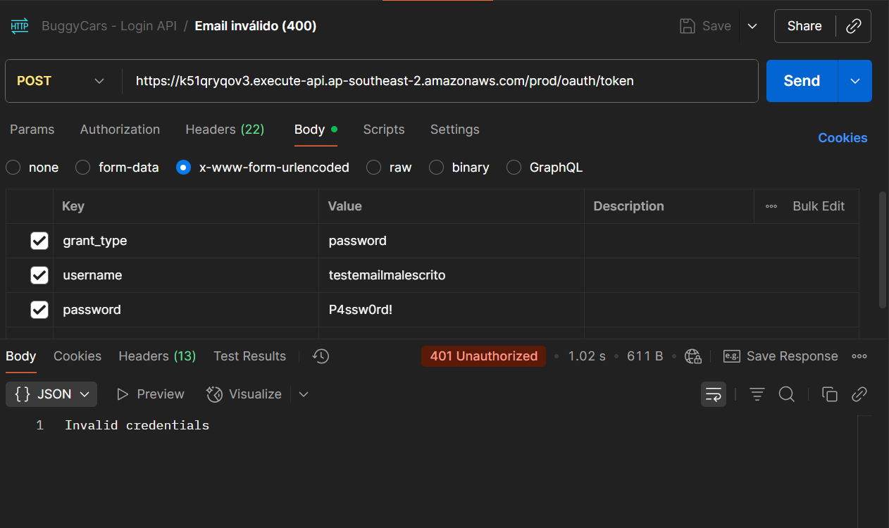
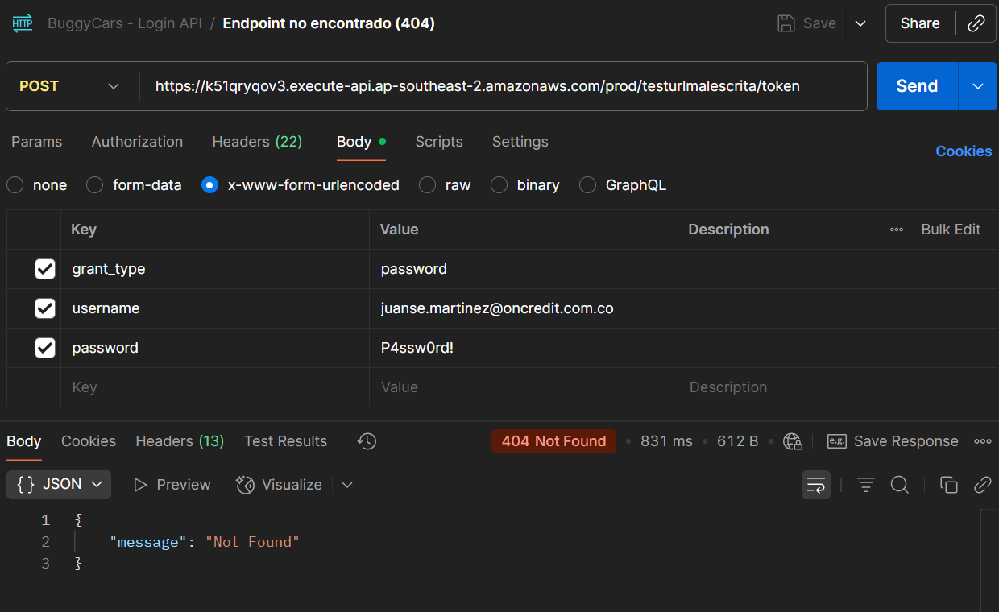

# API / Contract Testing

## Escenarios ejecutados
- Login válido → 200 con `access_token`, `token_type`, `expires_in`, `refresh_token`.
- Falta password → 400 Bad Request.
- Email inválido → 401 Unauthorized.
- Endpoint mal escrito → 404 Not Found.

### Evidencia API (Login)
Se ejecutaron pruebas con **Postman** sobre el endpoint de autenticación:  
`POST https://k51qryqov3.execute-api.ap-southeast-2.amazonaws.com/prod/oauth/token`

La colección completa está disponible en `api/postman_collection.json`.  
El contrato de respuesta esperado está definido en `api/contract-schemas/login.schema.json`.

**Hallazgos principales:**
- **Serios:**
  - Falta de un contrato de error unificado (los mensajes de error varían entre 400 y 401).
- **Moderados:**
  - Respuestas de error carecen de campos descriptivos estándar (ej. `error`, `message`).
  - Endpoint inexistente devuelve 404 sin cuerpo útil.
- **Menores:**
  - Respuesta válida no incluye campo opcional `scope` (común en OAuth2).
  - Ausencia de documentación pública del contrato de login.

**Recomendaciones:**
- Unificar esquema de errores en formato JSON (`{ "error": "invalid_credentials", "message": "Usuario o contraseña incorrectos" }`).
- Documentar los posibles códigos de estado (200, 400, 401, 404).
- Añadir atributos adicionales a la respuesta de login (`scope`, `issued_at`) para trazabilidad.
- Migrar a un flujo más seguro que el Password Grant (ej. Authorization Code + PKCE).

**Evidencia:**
- Colección Postman `api/postman_collection.json` con los 4 escenarios.  
- Capturas de ejecución    
- Contrato definido en `api/contract-schemas/login.schema.json`.  
