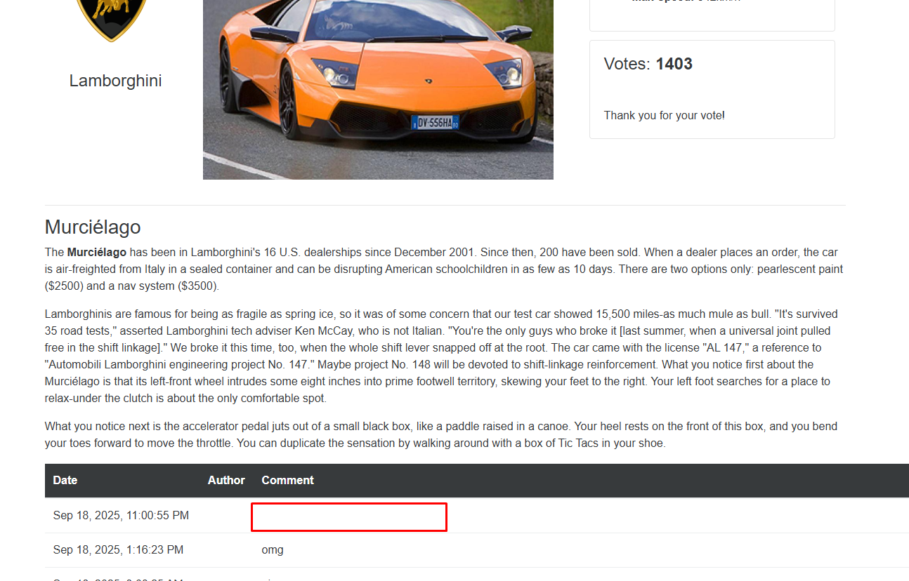
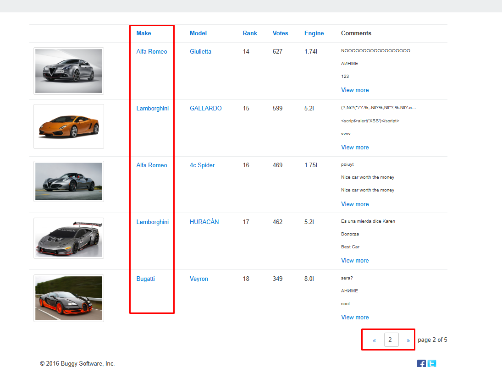
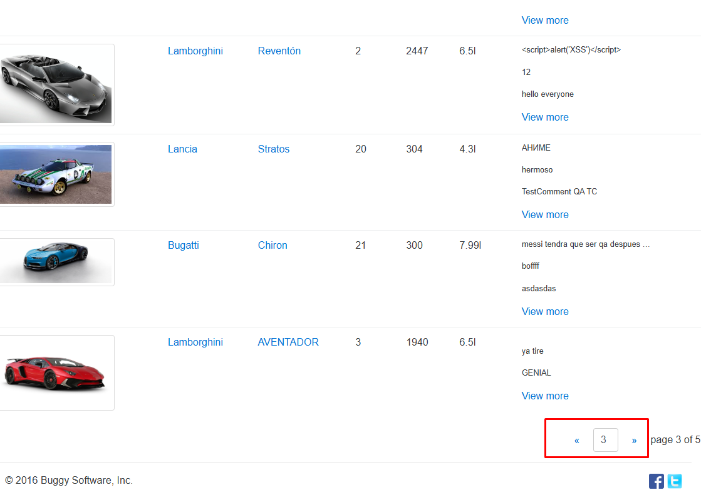

### Exploratorias

#### Charter 1: Autenticación / Registro
Duración: 25 min  
- Probado login con credenciales inválidas repetidas veces.  
- Verificado recarga de página tras login exitoso.  
- Validado persistencia de sesión.  

#### Charter 2: Voto / Comentario / Orden / Paginación
Duración: 25 min  
- Explorados votos consecutivos en el mismo modelo.  
- Revisión de consistencia de comentarios tras recarga.  
- Validación de orden en tablas con empate de votos.  

**Hallazgo 1:** Comentarios permiten cadenas vacías.  
- Pasos: Enviar comentario sin texto.  
- Actual: Se guarda comentario vacío.  
- Esperado: Validación que impida comentario vacío.  
- Impacto: Contenido basura, mal UX.  
- Evidencia: .

**Hallazgo 2: Ordenamiento no estable en tabla de ranking**  
- **Pasos para reproducir**  
  1. Iniciar sesión.  
  2. Ir a “Overall Rating”.  
  3. Ordenar la tabla por la columna “Votes” o “Rank”.  
  4. Recargar la página o navegar a la siguiente página de resultados.  
- **Resultado actual:** el orden cambia aleatoriamente, especialmente cuando hay empates en número de votos.  
- **Resultado esperado:** el sistema debería aplicar un criterio de desempate consistente (ej. alfabético).  
- **Impacto:** confusión para el usuario y dificultad para comparar datos.  
- **Evidencia:** 

**Hallazgo 3: Paginación no accesible por teclado**  
- **Pasos para reproducir**  
  1. Ir a “Overall Rating”.  
  2. Intentar navegar entre páginas usando solo la tecla `Tab` y `Enter`.  
- **Resultado actual:** el foco no se mueve claramente entre los botones de paginación o no es visible.  
- **Resultado esperado:** la paginación debería ser completamente operable por teclado y resaltar la página activa con `aria-current`.  
- **Impacto:** incumple pautas de accesibilidad (WCAG), dejando fuera a usuarios que dependen de teclado o lector de pantalla.  
- **Evidencia:** .
