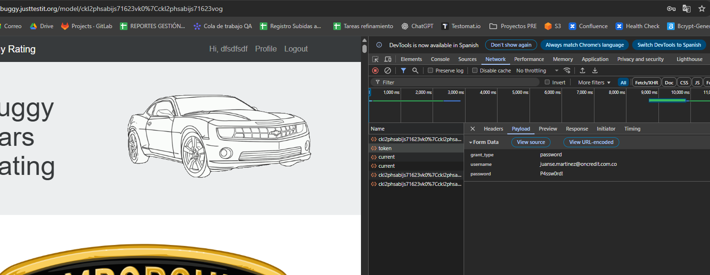
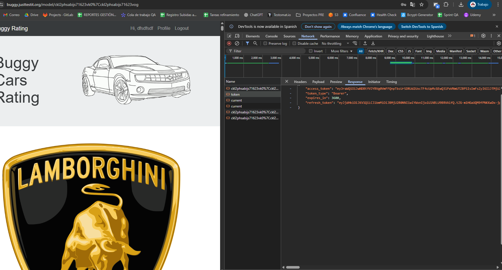
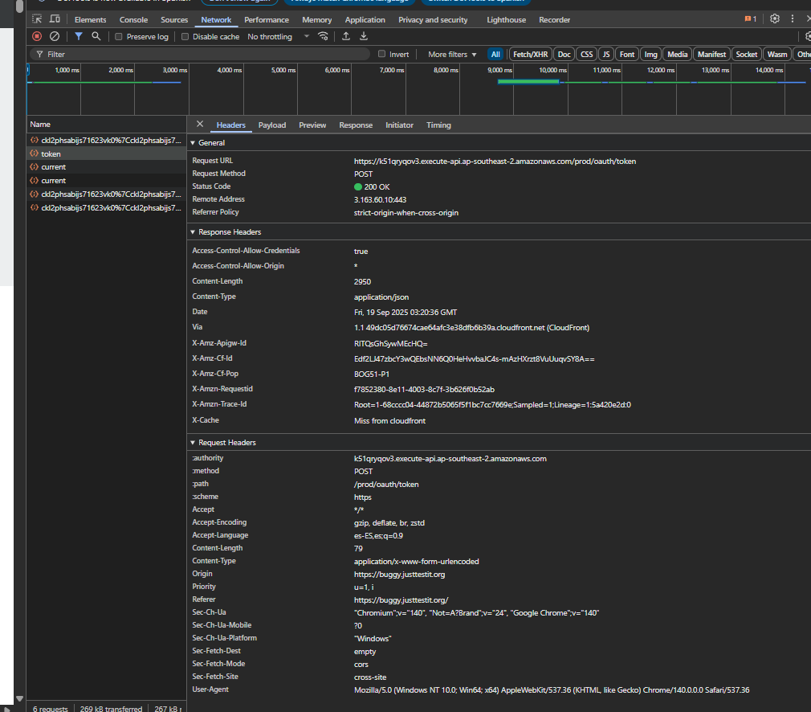
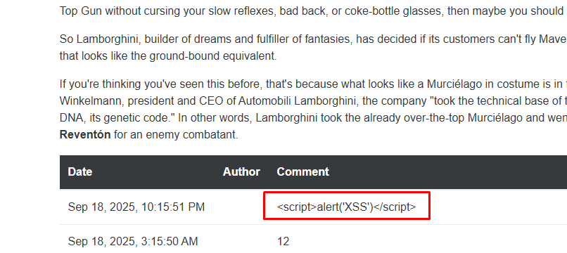

# Seguridad

## Revisiones
- No exponer contraseñas en UI ni logs 
    ### Hallazgo: Uso de flujo inseguro de autenticación (password grant)

    **Evidencia:**
    La petición `POST /prod/oauth/token` incluye los campos `username` y `password` en texto plano dentro del payload:
    - grant_type: password
    - username: <usuario@dominio>
    - password: <****>

    **Impacto:**
    - Riesgo de exposición de credenciales en clientes, DevTools, extensiones de navegador o logs.
    - Riesgo de robo de credenciales si existe una vulnerabilidad de XSS.
    - Uso de flujo ROPC (Resource Owner Password Credentials), considerado obsoleto e inseguro en OAuth2.

    **Recomendación:**
    - Migrar a un flujo seguro (Authorization Code Flow con PKCE).
    - Evitar enviar credenciales en requests directas desde el cliente.
    - Aplicar cabeceras de seguridad adicionales (CSP, HSTS, X-Frame-Options).
    - Monitorear y auditar accesos al endpoint `/token`.

- Cabeceras de seguridad (CSP, X-Frame-Options, X-Content-Type-Options, HSTS si aplica)  
    ### Hallazgo: Falta de cabeceras de seguridad en endpoint /token

    **Evidencia:**  
    El endpoint `POST /prod/oauth/token` devuelve únicamente cabeceras de CORS y tipo de contenido.  
    No se observan cabeceras de seguridad recomendadas.

    **Actual:**
    - Access-Control-Allow-Credentials: true
    - Access-Control-Allow-Origin: *
    - Content-Type: application/json
    - (No se devuelve CSP, X-Frame-Options, X-Content-Type-Options ni Strict-Transport-Security)

    **Impacto:**
    - Riesgo de XSS: sin Content-Security-Policy, un atacante puede inyectar scripts maliciosos.
    - Riesgo de clickjacking: sin X-Frame-Options, la página puede ser embebida en un iframe.
    - Riesgo de sniffing: sin X-Content-Type-Options, los navegadores pueden ejecutar contenido en tipos no esperados.
    - Riesgo en transporte: sin HSTS, un atacante podría forzar downgrade a HTTP.
    - Riesgo de CORS: combinación de `Allow-Credentials: true` + `Origin: *` es insegura; puede exponer tokens a otros orígenes.

    **Recomendación:**
    - Configurar cabeceras de seguridad estándar:
    - `Content-Security-Policy: default-src 'self';`
    - `X-Frame-Options: DENY`
    - `X-Content-Type-Options: nosniff`
    - `Strict-Transport-Security: max-age=31536000; includeSubDomains; preload`
    - Ajustar CORS para que **no permita origen `*`** cuando se usan credenciales.
    - Revisar política de expiración/rotación de `refresh_token`.

- XSS: sanitizar comentarios (probar payloads como `` deben ser escapados) 

## Evidencia sugerida
- Resultados básicos de ZAP Baseline (opcional)
    ### Evidencia ZAP Baseline
    Se ejecutó un escaneo automatizado con OWASP ZAP 2.16.1 sobre https://buggy.justtestit.org/.  
    El reporte completo está disponible en `security/zap-report.html`.

    **Resumen de hallazgos:**
    - Ausencia de **Content-Security-Policy (CSP)** → aumenta riesgo de XSS y carga de recursos externos no controlados.
    - Falta de cabecera **X-Frame-Options / frame-ancestors** → el sitio puede ser embebido en iframes (clickjacking).
    - Cabecera **CORS permisiva** (`Access-Control-Allow-Origin: *` con `Allow-Credentials: true`) → posible exposición de tokens a otros orígenes.
    - Falta de **Strict-Transport-Security (HSTS)** → no se fuerza HTTPS en navegadores.
    - Falta de **X-Content-Type-Options** → navegadores pueden hacer MIME sniffing.
    - **Cookie sin atributo HttpOnly** detectada → aumenta riesgo de robo de sesión por XSS.
    - Exposición de **cabecera Server (AmazonS3)** → facilita fingerprinting.
    - Comentarios y directivas de caché débiles → posible exposición de información innecesaria.
